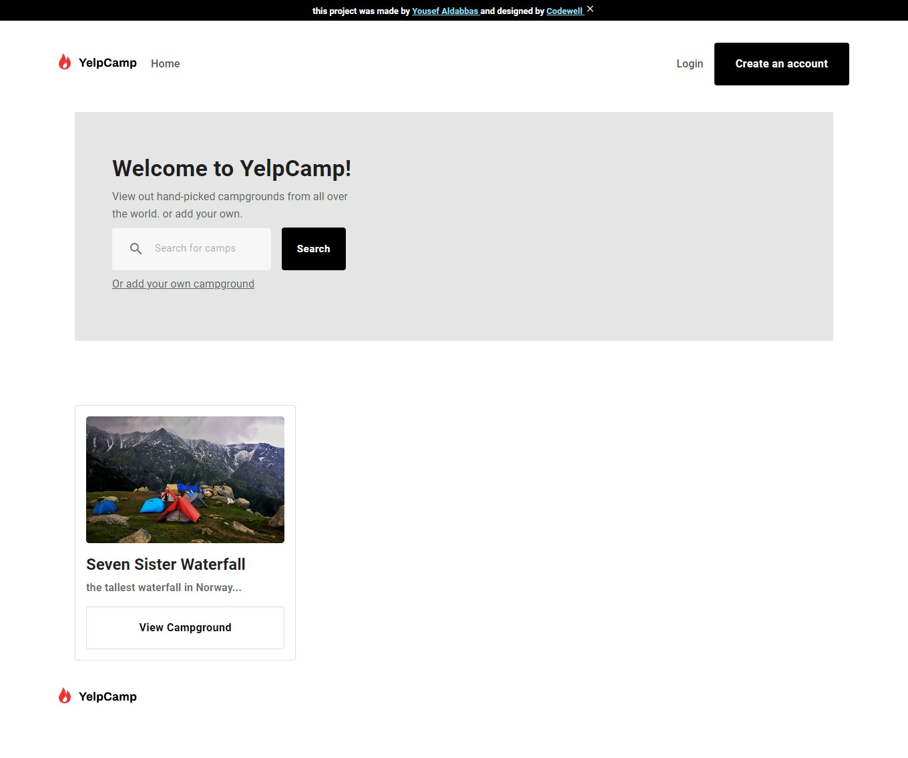

# codewell - Yelp camp solution

## Welcome! 👋

Thanks for checking out this project!

This is a solution for a Yelp camp challenge that consists on building a landing page that looks as close to the given design as possible. The goal is to improve my web layout skills by building a realistic project.

## Table of contents

- [Overview](#overview)
  - [The challenge](#the-challenge)
  - [Screenshot](#screenshot)
  - [Links](#links)
- [My process](#my-process)
  - [Built with](#built-with)
  - [Continued development](#continued-development)
- [Author](#author)

## Overview

### The challenge

Users should be able to:

- View the optimal layout for the site depending on their device's screen size
- See hover states for all interactive elements on the page
- sign in/sign up to the website
- add their campground information
- rate other's campground by share their experience with other users

### Screenshot

### Links

- Solution URL: [click here](https://github.com/YousefAldabbas/yelp-camp)
- Challenge URL: [click here](https://www.codewell.cc/challenges/yelpcamp-by-colt-steele--6144c7c8a383e41090a3d84b)

## My process

### Built with
#### frontend technology
- React
- Mui
- toastify
#### backend technology
- Node
- express
- mongoDB

### Continued development
- I'm going to rebuild the frontend with better technology( without MUi in this case ) because i ended up by restyling(rebuild) almost every component
- clean the code

## Author
- Twitter - [@joseph2s5](https://www.twitter.com/joseph2s5)

